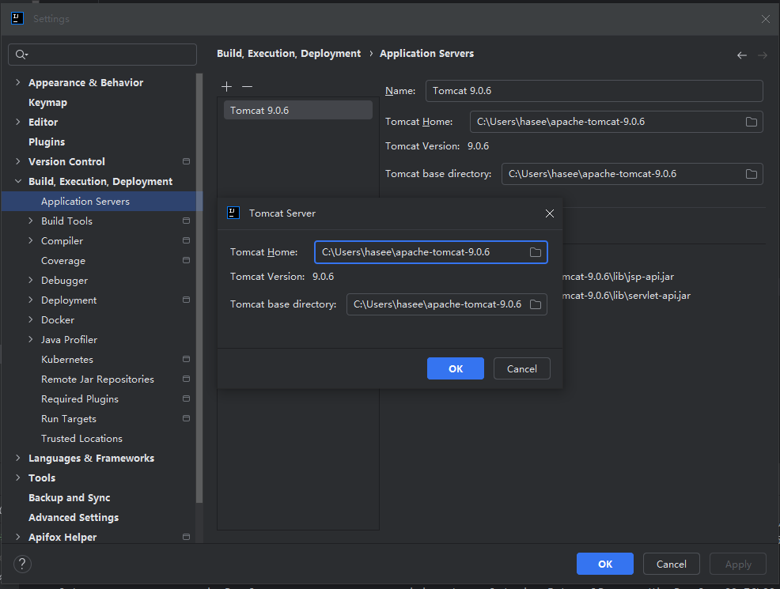
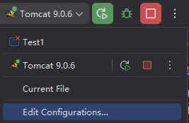
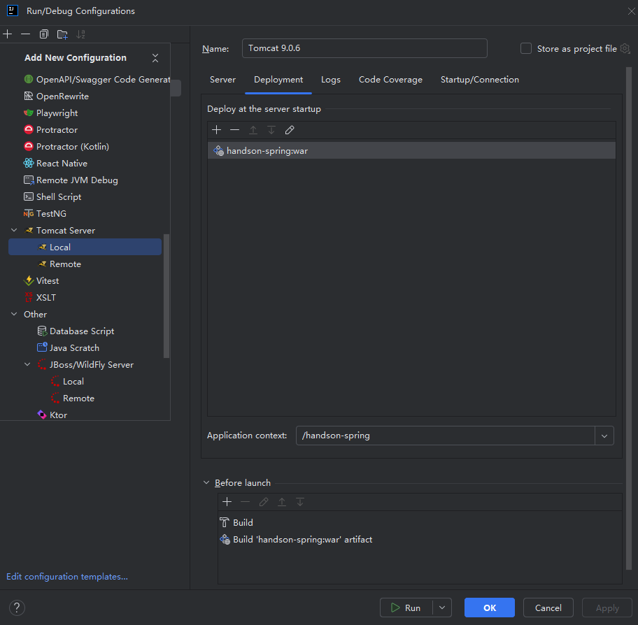

# handson-spring
为什么要创建该项目？

虽然 Spring 是开源的，但是面对如此庞大且复杂的源代码，总会让初学者显得束手无措。

Spring 是 Java 开发事实上的平台。深入理解 Spring 基础框架的底层原理很有必要，它能让我们以不变应万变，把握住技术快速流变中相对稳定的内核。

业界总是说“不要重新造轮子”，话虽不错，不过那是对商业机构说的，对我们来说，只有自己动手重新造轮子才能真正地理解知识。

本项目采用多分支开发，从一个最简单的程序开始，一步步堆积演化，每写一小段代码，都是一个可运行的程度。我希望你能够抵达山顶，一览众山小。


## 开发环境
- javax.servlet-api
- tomcat10-
- Idea
- jdk8
  
说明：Tomcat 10是第一个不再使用javax.servlet和相关包的版本，MiniSpringFramework没有对Tomcat 10做适配。
> 在Tomcat 10+中，Servlet API已经迁移到了Jakarta EE命名空间（jakarta.servlet）。这是因为Java EE已经转移到了Eclipse基金会，并更名为Jakarta EE。因此，Servlet API也需要进行相应的更改

## 环境配置
以main分支为例

http://tomcat.apache.org/ ，下载apache-tomcat-9.0.6并解压


启动入口编辑edit configuration



关键配置，deployment指定war包和tomcat请求上下文


启动！
```shell
C:\Users\hasee\apache-tomcat-9.0.6\bin\catalina.bat run
[2025-01-03 09:44:05,471] Artifact handson-spring:war: Waiting for server connection to start artifact deployment…
Using CATALINA_BASE:   "C:\Users\hasee\AppData\Local\JetBrains\IntelliJIdea2024.3\tomcat\fffd6e1b-2d2b-458c-9129-d313d43d12ab"
Using CATALINA_HOME:   "C:\Users\hasee\apache-tomcat-9.0.6"
Using CATALINA_TMPDIR: "C:\Users\hasee\apache-tomcat-9.0.6\temp"
Using JRE_HOME:        "C:\Users\hasee\.jdks\corretto-1.8.0_392"
Using CLASSPATH:       "C:\Users\hasee\apache-tomcat-9.0.6\bin\bootstrap.jar;C:\Users\hasee\apache-tomcat-9.0.6\bin\tomcat-juli.jar"
03-Jan-2025 21:44:07.237 ��Ϣ [main] org.apache.catalina.startup.VersionLoggerListener.log Server version:        Apache Tomcat/9.0.6
03-Jan-2025 21:44:07.241 ��Ϣ [main] org.apache.catalina.startup.VersionLoggerListener.log Server built:          Mar 5 2018 09:34:35 UTC
03-Jan-2025 21:44:07.241 ��Ϣ [main] org.apache.catalina.startup.VersionLoggerListener.log Server number:         9.0.6.0
03-Jan-2025 21:44:07.241 ��Ϣ [main] org.apache.catalina.startup.VersionLoggerListener.log OS Name:               Windows 10
03-Jan-2025 21:44:07.242 ��Ϣ [main] org.apache.catalina.startup.VersionLoggerListener.log OS Version:            10.0
03-Jan-2025 21:44:07.242 ��Ϣ [main] org.apache.catalina.startup.VersionLoggerListener.log Architecture:          amd64
03-Jan-2025 21:44:07.242 ��Ϣ [main] org.apache.catalina.startup.VersionLoggerListener.log Java Home:             C:\Users\hasee\.jdks\corretto-1.8.0_392\jre
03-Jan-2025 21:44:07.242 ��Ϣ [main] org.apache.catalina.startup.VersionLoggerListener.log JVM Version:           1.8.0_392-b08
03-Jan-2025 21:44:07.242 ��Ϣ [main] org.apache.catalina.startup.VersionLoggerListener.log JVM Vendor:            Amazon.com Inc.
03-Jan-2025 21:44:07.242 ��Ϣ [main] org.apache.catalina.startup.VersionLoggerListener.log CATALINA_BASE:         C:\Users\hasee\AppData\Local\JetBrains\IntelliJIdea2024.3\tomcat\fffd6e1b-2d2b-458c-9129-d313d43d12ab
03-Jan-2025 21:44:07.242 ��Ϣ [main] org.apache.catalina.startup.VersionLoggerListener.log CATALINA_HOME:         C:\Users\hasee\apache-tomcat-9.0.6
03-Jan-2025 21:44:07.243 ��Ϣ [main] org.apache.catalina.startup.VersionLoggerListener.log Command line argument: -Djava.util.logging.config.file=C:\Users\hasee\AppData\Local\JetBrains\IntelliJIdea2024.3\tomcat\fffd6e1b-2d2b-458c-9129-d313d43d12ab\conf\logging.properties
03-Jan-2025 21:44:07.243 ��Ϣ [main] org.apache.catalina.startup.VersionLoggerListener.log Command line argument: -Djava.util.logging.manager=org.apache.juli.ClassLoaderLogManager
03-Jan-2025 21:44:07.243 ��Ϣ [main] org.apache.catalina.startup.VersionLoggerListener.log Command line argument: -Dcom.sun.management.jmxremote=
03-Jan-2025 21:44:07.243 ��Ϣ [main] org.apache.catalina.startup.VersionLoggerListener.log Command line argument: -Dcom.sun.management.jmxremote.port=1099
03-Jan-2025 21:44:07.243 ��Ϣ [main] org.apache.catalina.startup.VersionLoggerListener.log Command line argument: -Dcom.sun.management.jmxremote.ssl=false
03-Jan-2025 21:44:07.243 ��Ϣ [main] org.apache.catalina.startup.VersionLoggerListener.log Command line argument: -Dcom.sun.management.jmxremote.password.file=C:\Users\hasee\AppData\Local\JetBrains\IntelliJIdea2024.3\tomcat\fffd6e1b-2d2b-458c-9129-d313d43d12ab\jmxremote.password
03-Jan-2025 21:44:07.243 ��Ϣ [main] org.apache.catalina.startup.VersionLoggerListener.log Command line argument: -Dcom.sun.management.jmxremote.access.file=C:\Users\hasee\AppData\Local\JetBrains\IntelliJIdea2024.3\tomcat\fffd6e1b-2d2b-458c-9129-d313d43d12ab\jmxremote.access
03-Jan-2025 21:44:07.244 ��Ϣ [main] org.apache.catalina.startup.VersionLoggerListener.log Command line argument: -Djava.rmi.server.hostname=127.0.0.1
03-Jan-2025 21:44:07.244 ��Ϣ [main] org.apache.catalina.startup.VersionLoggerListener.log Command line argument: -Djdk.tls.ephemeralDHKeySize=2048
03-Jan-2025 21:44:07.244 ��Ϣ [main] org.apache.catalina.startup.VersionLoggerListener.log Command line argument: -Djava.protocol.handler.pkgs=org.apache.catalina.webresources
03-Jan-2025 21:44:07.244 ��Ϣ [main] org.apache.catalina.startup.VersionLoggerListener.log Command line argument: -Dignore.endorsed.dirs=
03-Jan-2025 21:44:07.244 ��Ϣ [main] org.apache.catalina.startup.VersionLoggerListener.log Command line argument: -Dcatalina.base=C:\Users\hasee\AppData\Local\JetBrains\IntelliJIdea2024.3\tomcat\fffd6e1b-2d2b-458c-9129-d313d43d12ab
03-Jan-2025 21:44:07.244 ��Ϣ [main] org.apache.catalina.startup.VersionLoggerListener.log Command line argument: -Dcatalina.home=C:\Users\hasee\apache-tomcat-9.0.6
03-Jan-2025 21:44:07.244 ��Ϣ [main] org.apache.catalina.startup.VersionLoggerListener.log Command line argument: -Djava.io.tmpdir=C:\Users\hasee\apache-tomcat-9.0.6\temp
03-Jan-2025 21:44:07.245 ��Ϣ [main] org.apache.catalina.core.AprLifecycleListener.lifecycleEvent Loaded APR based Apache Tomcat Native library [2.0.3] using APR version [1.7.2].
03-Jan-2025 21:44:07.245 ��Ϣ [main] org.apache.catalina.core.AprLifecycleListener.lifecycleEvent APR capabilities: IPv6 [true], sendfile [true], accept filters [false], random [true].
03-Jan-2025 21:44:07.245 ��Ϣ [main] org.apache.catalina.core.AprLifecycleListener.lifecycleEvent APR/OpenSSL configuration: useAprConnector [false], useOpenSSL [true]
03-Jan-2025 21:44:07.253 ��Ϣ [main] org.apache.catalina.core.AprLifecycleListener.initializeSSL OpenSSL successfully initialized [OpenSSL 3.0.8 7 Feb 2023]
03-Jan-2025 21:44:07.352 ��Ϣ [main] org.apache.coyote.AbstractProtocol.init Initializing ProtocolHandler ["http-nio-8080"]
03-Jan-2025 21:44:07.369 ��Ϣ [main] org.apache.tomcat.util.net.NioSelectorPool.getSharedSelector Using a shared selector for servlet write/read
03-Jan-2025 21:44:07.377 ��Ϣ [main] org.apache.coyote.AbstractProtocol.init Initializing ProtocolHandler ["ajp-nio-8009"]
03-Jan-2025 21:44:07.382 ��Ϣ [main] org.apache.tomcat.util.net.NioSelectorPool.getSharedSelector Using a shared selector for servlet write/read
03-Jan-2025 21:44:07.382 ��Ϣ [main] org.apache.catalina.startup.Catalina.load Initialization processed in 577 ms
03-Jan-2025 21:44:07.427 ��Ϣ [main] org.apache.catalina.core.StandardService.startInternal Starting service [Catalina]
03-Jan-2025 21:44:07.427 ��Ϣ [main] org.apache.catalina.core.StandardEngine.startInternal Starting Servlet Engine: Apache Tomcat/9.0.6
03-Jan-2025 21:44:07.441 ��Ϣ [main] org.apache.coyote.AbstractProtocol.start Starting ProtocolHandler ["http-nio-8080"]
03-Jan-2025 21:44:07.457 ��Ϣ [main] org.apache.coyote.AbstractProtocol.start Starting ProtocolHandler ["ajp-nio-8009"]
03-Jan-2025 21:44:07.460 ��Ϣ [main] org.apache.catalina.startup.Catalina.start Server startup in 77 ms
Connected to server
[2025-01-03 09:44:07,557] Artifact handson-spring:war: Artifact is being deployed, please wait…
03-Jan-2025 21:44:08.633 ��Ϣ [RMI TCP Connection(2)-127.0.0.1] org.apache.jasper.servlet.TldScanner.scanJars At least one JAR was scanned for TLDs yet contained no TLDs. Enable debug logging for this logger for a complete list of JARs that were scanned but no TLDs were found in them. Skipping unneeded JARs during scanning can improve startup time and JSP compilation time.
.........MyBeanFactoryPostProcessor...........
try to registerBeanPostProcessors
 registerBeanPostProcessors : com.minis.scheduling.annotation.AsyncAnnotationBeanPostProcessor
get bean null -------------- asyncAnnotationBeanPostProcessor
asyncAnnotationBeanPostProcessor bean created. com.minis.scheduling.annotation.AsyncAnnotationBeanPostProcessor : com.minis.scheduling.annotation.AsyncAnnotationBeanPostProcessor@26a88d9
handle properties for bean : asyncAnnotationBeanPostProcessor
 bean registerded............. asyncAnnotationBeanPostProcessor
 class proxy after bean post processor class com.minis.scheduling.annotation.AsyncAnnotationBeanPostProcessor
 bean registerded............. asyncAnnotationBeanPostProcessor
normal bean -------------- asyncAnnotationBeanPostProcessor----------------com.minis.scheduling.annotation.AsyncAnnotationBeanPostProcessor@26a88d9
 registerBeanPostProcessors : com.minis.beans.factory.annotation.AutowiredAnnotationBeanPostProcessor
get bean null -------------- autowiredAnnotationBeanPostProcessor
autowiredAnnotationBeanPostProcessor bean created. com.minis.beans.factory.annotation.AutowiredAnnotationBeanPostProcessor : com.minis.beans.factory.annotation.AutowiredAnnotationBeanPostProcessor@2eb36cae
handle properties for bean : autowiredAnnotationBeanPostProcessor
 bean registerded............. autowiredAnnotationBeanPostProcessor
 class proxy after bean post processor class com.minis.beans.factory.annotation.AutowiredAnnotationBeanPostProcessor
 bean registerded............. autowiredAnnotationBeanPostProcessor
normal bean -------------- autowiredAnnotationBeanPostProcessor----------------com.minis.beans.factory.annotation.AutowiredAnnotationBeanPostProcessor@2eb36cae
 registerBeanPostProcessors : com.test.LogBeanPostProcessor
get bean null -------------- logBeanPostProcessor
logBeanPostProcessor bean created. com.test.LogBeanPostProcessor : com.test.LogBeanPostProcessor@2be12115
handle properties for bean : logBeanPostProcessor
 bean registerded............. logBeanPostProcessor
 class proxy after bean post processor class com.test.LogBeanPostProcessor
 bean registerded............. logBeanPostProcessor
normal bean -------------- logBeanPostProcessor----------------com.test.LogBeanPostProcessor@2be12115
 registerBeanPostProcessors : com.minis.aop.framework.autoproxy.BeanNameAutoProxyCreator
get bean null -------------- autoProxyCreator
autoProxyCreator bean created. com.minis.aop.framework.autoproxy.BeanNameAutoProxyCreator : com.minis.aop.framework.autoproxy.BeanNameAutoProxyCreator@48f89de1
handle properties for bean : autoProxyCreator
 bean registerded............. autoProxyCreator
postProcessBeforeInitialization : autoProxyCreator
 class proxy after bean post processor class com.minis.aop.framework.autoproxy.BeanNameAutoProxyCreator
postProcessAfterInitialization : autoProxyCreator
 bean registerded............. autoProxyCreator
normal bean -------------- autoProxyCreator----------------com.minis.aop.framework.autoproxy.BeanNameAutoProxyCreator@48f89de1
get bean null -------------- bbs
bbs bean created. com.test.service.BaseBaseService : com.test.service.BaseBaseService@55636380
handle properties for bean : bbs
get bean null -------------- aservice
aservice bean created. com.test.service.AServiceImpl : com.test.service.AServiceImpl@7218ed14
handle properties for bean : aservice
get bean null -------------- baseservice
baseservice bean created. com.test.service.BaseService : com.test.service.BaseService@49f37c5f
handle properties for bean : baseservice
 bean registerded............. baseservice
normal bean -------------- bbs----------------com.test.service.BaseBaseService@55636380
autowire bbs for bean baseservice
autowire bbs for bean baseservice : com.test.service.BaseBaseService@55636380 class : class com.test.service.BaseBaseService
postProcessBeforeInitialization : baseservice
 try to create proxy for : baseservice
 match?baseservice:action*
 class proxy after bean post processor class com.test.service.BaseService
postProcessAfterInitialization : baseservice
 bean registerded............. baseservice
normal bean -------------- baseservice----------------com.test.service.BaseService@49f37c5f
 bean registerded............. aservice
postProcessBeforeInitialization : aservice
 try to create proxy for : aservice
 match?aservice:action*
 class proxy after bean post processor class com.test.service.AServiceImpl
postProcessAfterInitialization : aservice
 bean registerded............. aservice
normal bean -------------- aservice----------------com.test.service.AServiceImpl@7218ed14
 bean registerded............. bbs
postProcessBeforeInitialization : bbs
 try to create proxy for : bbs
 match?bbs:action*
 class proxy after bean post processor class com.test.service.BaseBaseService
..........call init-mothod..........
postProcessAfterInitialization : bbs
 bean registerded............. bbs
normal bean -------------- bbs----------------com.test.service.BaseBaseService@55636380
bean exist -------------- aservice----------------com.test.service.AServiceImpl@7218ed14
normal bean -------------- aservice----------------com.test.service.AServiceImpl@7218ed14
bean exist -------------- baseservice----------------com.test.service.BaseService@49f37c5f
normal bean -------------- baseservice----------------com.test.service.BaseService@49f37c5f
get bean null -------------- userService
userService bean created. com.test.service.UserService : com.test.service.UserService@11314941
handle properties for bean : userService
 bean registerded............. userService
get bean null -------------- jdbcTemplate
jdbcTemplate bean created. com.minis.jdbc.core.JdbcTemplate : com.minis.jdbc.core.JdbcTemplate@b6c3afb
handle properties for bean : jdbcTemplate
get bean null -------------- dataSource
dataSource bean created. com.minis.jdbc.pool.PooledDataSource : com.minis.jdbc.pool.PooledDataSource@576ba6cf
handle properties for bean : dataSource
 bean registerded............. dataSource
postProcessBeforeInitialization : dataSource
 try to create proxy for : dataSource
 match?dataSource:action*
 class proxy after bean post processor class com.minis.jdbc.pool.PooledDataSource
postProcessAfterInitialization : dataSource
 bean registerded............. dataSource
normal bean -------------- dataSource----------------com.minis.jdbc.pool.PooledDataSource@576ba6cf
 bean registerded............. jdbcTemplate
postProcessBeforeInitialization : jdbcTemplate
 try to create proxy for : jdbcTemplate
 match?jdbcTemplate:action*
 class proxy after bean post processor class com.minis.jdbc.core.JdbcTemplate
postProcessAfterInitialization : jdbcTemplate
 bean registerded............. jdbcTemplate
normal bean -------------- jdbcTemplate----------------com.minis.jdbc.core.JdbcTemplate@b6c3afb
autowire jdbcTemplate for bean userService
autowire jdbcTemplate for bean userService : com.minis.jdbc.core.JdbcTemplate@b6c3afb class : class com.minis.jdbc.core.JdbcTemplate
postProcessBeforeInitialization : userService
 try to create proxy for : userService
 match?userService:action*
 class proxy after bean post processor class com.test.service.UserService
postProcessAfterInitialization : userService
 bean registerded............. userService
normal bean -------------- userService----------------com.test.service.UserService@11314941
get bean null -------------- taskExecutor
taskExecutor bean created. com.minis.scheduling.concurrent.ThreadPoolTaskExecutor : com.minis.scheduling.concurrent.ThreadPoolTaskExecutor@32e7afd3
handle properties for bean : taskExecutor
 bean registerded............. taskExecutor
postProcessBeforeInitialization : taskExecutor
 try to create proxy for : taskExecutor
 match?taskExecutor:action*
 class proxy after bean post processor class com.minis.scheduling.concurrent.ThreadPoolTaskExecutor
postProcessAfterInitialization : taskExecutor
 bean registerded............. taskExecutor
normal bean -------------- taskExecutor----------------com.minis.scheduling.concurrent.ThreadPoolTaskExecutor@32e7afd3
get bean null -------------- asyncExecutionInterceptor
asyncExecutionInterceptor bean created. com.minis.aop.AsyncExecutionInterceptor : com.minis.aop.AsyncExecutionInterceptor@286f25b5
handle properties for bean : asyncExecutionInterceptor
bean exist -------------- taskExecutor----------------com.minis.scheduling.concurrent.ThreadPoolTaskExecutor@32e7afd3
normal bean -------------- taskExecutor----------------com.minis.scheduling.concurrent.ThreadPoolTaskExecutor@32e7afd3
 bean registerded............. asyncExecutionInterceptor
postProcessBeforeInitialization : asyncExecutionInterceptor
 try to create proxy for : asyncExecutionInterceptor
 match?asyncExecutionInterceptor:action*
 class proxy after bean post processor class com.minis.aop.AsyncExecutionInterceptor
postProcessAfterInitialization : asyncExecutionInterceptor
 bean registerded............. asyncExecutionInterceptor
normal bean -------------- asyncExecutionInterceptor----------------com.minis.aop.AsyncExecutionInterceptor@286f25b5
get bean null -------------- asyncAnnotationAdvisor
asyncAnnotationAdvisor bean created. com.minis.scheduling.annotation.AsyncAnnotationAdvisor : com.minis.scheduling.annotation.AsyncAnnotationAdvisor@6633dbc4
handle properties for bean : asyncAnnotationAdvisor
bean exist -------------- asyncExecutionInterceptor----------------com.minis.aop.AsyncExecutionInterceptor@286f25b5
normal bean -------------- asyncExecutionInterceptor----------------com.minis.aop.AsyncExecutionInterceptor@286f25b5
 bean registerded............. asyncAnnotationAdvisor
postProcessBeforeInitialization : asyncAnnotationAdvisor
 try to create proxy for : asyncAnnotationAdvisor
 match?asyncAnnotationAdvisor:action*
 class proxy after bean post processor class com.minis.scheduling.annotation.AsyncAnnotationAdvisor
postProcessAfterInitialization : asyncAnnotationAdvisor
 bean registerded............. asyncAnnotationAdvisor
normal bean -------------- asyncAnnotationAdvisor----------------com.minis.scheduling.annotation.AsyncAnnotationAdvisor@6633dbc4
bean exist -------------- asyncAnnotationBeanPostProcessor----------------com.minis.scheduling.annotation.AsyncAnnotationBeanPostProcessor@26a88d9
normal bean -------------- asyncAnnotationBeanPostProcessor----------------com.minis.scheduling.annotation.AsyncAnnotationBeanPostProcessor@26a88d9
bean exist -------------- autowiredAnnotationBeanPostProcessor----------------com.minis.beans.factory.annotation.AutowiredAnnotationBeanPostProcessor@2eb36cae
normal bean -------------- autowiredAnnotationBeanPostProcessor----------------com.minis.beans.factory.annotation.AutowiredAnnotationBeanPostProcessor@2eb36cae
bean exist -------------- logBeanPostProcessor----------------com.test.LogBeanPostProcessor@2be12115
normal bean -------------- logBeanPostProcessor----------------com.test.LogBeanPostProcessor@2be12115
bean exist -------------- autoProxyCreator----------------com.minis.aop.framework.autoproxy.BeanNameAutoProxyCreator@48f89de1
normal bean -------------- autoProxyCreator----------------com.minis.aop.framework.autoproxy.BeanNameAutoProxyCreator@48f89de1
get bean null -------------- action
action bean created. com.test.service.Action1 : com.test.service.Action1@36e0c1fe
handle properties for bean : action
 bean registerded............. action
postProcessBeforeInitialization : action
 try to create proxy for : action
 match?action:action*
actionbean name matched, action* create proxy for com.test.service.Action1@36e0c1fe
 class proxy after bean post processor class com.minis.aop.framework.ProxyFactoryBean
postProcessAfterInitialization : action
 bean registerded............. action
factory bean -------------- action----------------com.minis.aop.framework.ProxyFactoryBean@73cf43a9
get bean null -------------- advisor
advisor bean created. com.minis.aop.NameMatchMethodPointcutAdvisor : com.minis.aop.NameMatchMethodPointcutAdvisor@4310831f
handle properties for bean : advisor
get bean null -------------- beforeAdvice
beforeAdvice bean created. com.test.service.MyBeforeAdvice : com.test.service.MyBeforeAdvice@84b1199
handle properties for bean : beforeAdvice
 bean registerded............. beforeAdvice
postProcessBeforeInitialization : beforeAdvice
 try to create proxy for : beforeAdvice
 match?beforeAdvice:action*
 class proxy after bean post processor class com.test.service.MyBeforeAdvice
postProcessAfterInitialization : beforeAdvice
 bean registerded............. beforeAdvice
normal bean -------------- beforeAdvice----------------com.test.service.MyBeforeAdvice@84b1199
 bean registerded............. advisor
postProcessBeforeInitialization : advisor
 try to create proxy for : advisor
 match?advisor:action*
 class proxy after bean post processor class com.minis.aop.NameMatchMethodPointcutAdvisor
postProcessAfterInitialization : advisor
 bean registerded............. advisor
normal bean -------------- advisor----------------com.minis.aop.NameMatchMethodPointcutAdvisor@4310831f
get bean null -------------- action2
action2 bean created. com.test.service.Action2 : com.test.service.Action2@1dc470dd
handle properties for bean : action2
 bean registerded............. action2
postProcessBeforeInitialization : action2
 try to create proxy for : action2
 match?action2:action*
action2bean name matched, action* create proxy for com.test.service.Action2@1dc470dd
 class proxy after bean post processor class com.minis.aop.framework.ProxyFactoryBean
postProcessAfterInitialization : action2
 bean registerded............. action2
factory bean -------------- action2----------------com.minis.aop.framework.ProxyFactoryBean@21b62e08
bean exist -------------- advisor----------------com.minis.aop.NameMatchMethodPointcutAdvisor@4310831f
normal bean -------------- advisor----------------com.minis.aop.NameMatchMethodPointcutAdvisor@4310831f
get bean null -------------- executorTest
executorTest bean created. com.test.service.ExecutorTest : com.test.service.ExecutorTest@32112a64
handle properties for bean : executorTest
 bean registerded............. executorTest
bean exist -------------- taskExecutor----------------com.minis.scheduling.concurrent.ThreadPoolTaskExecutor@32e7afd3
normal bean -------------- taskExecutor----------------com.minis.scheduling.concurrent.ThreadPoolTaskExecutor@32e7afd3
autowire taskExecutor for bean executorTest
autowire taskExecutor for bean executorTest : com.minis.scheduling.concurrent.ThreadPoolTaskExecutor@32e7afd3 class : class com.minis.scheduling.concurrent.ThreadPoolTaskExecutor
postProcessBeforeInitialization : executorTest
 try to create proxy for : executorTest
 match?executorTest:action*
 class proxy after bean post processor class com.test.service.ExecutorTest
postProcessAfterInitialization : executorTest
 bean registerded............. executorTest
normal bean -------------- executorTest----------------com.test.service.ExecutorTest@32112a64
bean exist -------------- beforeAdvice----------------com.test.service.MyBeforeAdvice@84b1199
normal bean -------------- beforeAdvice----------------com.test.service.MyBeforeAdvice@84b1199
bean exist -------------- advisor----------------com.minis.aop.NameMatchMethodPointcutAdvisor@4310831f
normal bean -------------- advisor----------------com.minis.aop.NameMatchMethodPointcutAdvisor@4310831f
bean exist -------------- dataSource----------------com.minis.jdbc.pool.PooledDataSource@576ba6cf
normal bean -------------- dataSource----------------com.minis.jdbc.pool.PooledDataSource@576ba6cf
bean exist -------------- jdbcTemplate----------------com.minis.jdbc.core.JdbcTemplate@b6c3afb
normal bean -------------- jdbcTemplate----------------com.minis.jdbc.core.JdbcTemplate@b6c3afb
get bean null -------------- contextListener
contextListener bean created. com.test.MyListener : com.test.MyListener@5abd8161
handle properties for bean : contextListener
 bean registerded............. contextListener
postProcessBeforeInitialization : contextListener
 try to create proxy for : contextListener
 match?contextListener:action*
 class proxy after bean post processor class com.test.MyListener
postProcessAfterInitialization : contextListener
 bean registerded............. contextListener
normal bean -------------- contextListener----------------com.test.MyListener@5abd8161
get bean null -------------- beanFactoryPostProcessor
beanFactoryPostProcessor bean created. com.test.MyBeanFactoryPostProcessor : com.test.MyBeanFactoryPostProcessor@71127363
handle properties for bean : beanFactoryPostProcessor
 bean registerded............. beanFactoryPostProcessor
postProcessBeforeInitialization : beanFactoryPostProcessor
 try to create proxy for : beanFactoryPostProcessor
 match?beanFactoryPostProcessor:action*
 class proxy after bean post processor class com.test.MyBeanFactoryPostProcessor
postProcessAfterInitialization : beanFactoryPostProcessor
 bean registerded............. beanFactoryPostProcessor
normal bean -------------- beanFactoryPostProcessor----------------com.test.MyBeanFactoryPostProcessor@71127363
get bean null -------------- handlerMapping
handlerMapping bean created. com.minis.web.method.annotation.RequestMappingHandlerMapping : com.minis.web.method.annotation.RequestMappingHandlerMapping@242f7071
handle properties for bean : handlerMapping
 bean registerded............. handlerMapping
postProcessBeforeInitialization : handlerMapping
 try to create proxy for : handlerMapping
 match?handlerMapping:action*
 class proxy after bean post processor class com.minis.web.method.annotation.RequestMappingHandlerMapping
postProcessAfterInitialization : handlerMapping
 bean registerded............. handlerMapping
normal bean -------------- handlerMapping----------------com.minis.web.method.annotation.RequestMappingHandlerMapping@242f7071
get bean null -------------- handlerAdapter
handlerAdapter bean created. com.minis.web.method.annotation.RequestMappingHandlerAdapter : com.minis.web.method.annotation.RequestMappingHandlerAdapter@55ae5bf6
handle properties for bean : handlerAdapter
get bean null -------------- messageConverter
messageConverter bean created. com.minis.http.converter.DefaultHttpMessageConverter : com.minis.http.converter.DefaultHttpMessageConverter@3d073db2
handle properties for bean : messageConverter
get bean null -------------- objectMapper
objectMapper bean created. com.minis.util.DefaultObjectMapper : com.minis.util.DefaultObjectMapper@62746e9b
handle properties for bean : objectMapper
 bean registerded............. objectMapper
postProcessBeforeInitialization : objectMapper
 try to create proxy for : objectMapper
 match?objectMapper:action*
 class proxy after bean post processor class com.minis.util.DefaultObjectMapper
postProcessAfterInitialization : objectMapper
 bean registerded............. objectMapper
normal bean -------------- objectMapper----------------com.minis.util.DefaultObjectMapper@62746e9b
 bean registerded............. messageConverter
postProcessBeforeInitialization : messageConverter
 try to create proxy for : messageConverter
 match?messageConverter:action*
 class proxy after bean post processor class com.minis.http.converter.DefaultHttpMessageConverter
postProcessAfterInitialization : messageConverter
 bean registerded............. messageConverter
normal bean -------------- messageConverter----------------com.minis.http.converter.DefaultHttpMessageConverter@3d073db2
get bean null -------------- webBindingInitializer
webBindingInitializer bean created. com.test.DateInitializer : com.test.DateInitializer@1aaa3474
handle properties for bean : webBindingInitializer
 bean registerded............. webBindingInitializer
postProcessBeforeInitialization : webBindingInitializer
 try to create proxy for : webBindingInitializer
 match?webBindingInitializer:action*
 class proxy after bean post processor class com.test.DateInitializer
postProcessAfterInitialization : webBindingInitializer
 bean registerded............. webBindingInitializer
normal bean -------------- webBindingInitializer----------------com.test.DateInitializer@1aaa3474
 bean registerded............. handlerAdapter
postProcessBeforeInitialization : handlerAdapter
 try to create proxy for : handlerAdapter
 match?handlerAdapter:action*
 class proxy after bean post processor class com.minis.web.method.annotation.RequestMappingHandlerAdapter
postProcessAfterInitialization : handlerAdapter
 bean registerded............. handlerAdapter
normal bean -------------- handlerAdapter----------------com.minis.web.method.annotation.RequestMappingHandlerAdapter@55ae5bf6
bean exist -------------- webBindingInitializer----------------com.test.DateInitializer@1aaa3474
normal bean -------------- webBindingInitializer----------------com.test.DateInitializer@1aaa3474
bean exist -------------- messageConverter----------------com.minis.http.converter.DefaultHttpMessageConverter@3d073db2
normal bean -------------- messageConverter----------------com.minis.http.converter.DefaultHttpMessageConverter@3d073db2
bean exist -------------- objectMapper----------------com.minis.util.DefaultObjectMapper@62746e9b
normal bean -------------- objectMapper----------------com.minis.util.DefaultObjectMapper@62746e9b
get bean null -------------- viewResolver
viewResolver bean created. com.minis.web.servlet.view.InternalResourceViewResolver : com.minis.web.servlet.view.InternalResourceViewResolver@9c7fb88
handle properties for bean : viewResolver
 bean registerded............. viewResolver
postProcessBeforeInitialization : viewResolver
 try to create proxy for : viewResolver
 match?viewResolver:action*
 class proxy after bean post processor class com.minis.web.servlet.view.InternalResourceViewResolver
postProcessAfterInitialization : viewResolver
 bean registerded............. viewResolver
normal bean -------------- viewResolver----------------com.minis.web.servlet.view.InternalResourceViewResolver@9c7fb88
bean exist -------------- bbs----------------com.test.service.BaseBaseService@55636380
normal bean -------------- bbs----------------com.test.service.BaseBaseService@55636380
bean exist -------------- aservice----------------com.test.service.AServiceImpl@7218ed14
normal bean -------------- aservice----------------com.test.service.AServiceImpl@7218ed14
bean exist -------------- baseservice----------------com.test.service.BaseService@49f37c5f
normal bean -------------- baseservice----------------com.test.service.BaseService@49f37c5f
bean exist -------------- userService----------------com.test.service.UserService@11314941
normal bean -------------- userService----------------com.test.service.UserService@11314941
bean exist -------------- taskExecutor----------------com.minis.scheduling.concurrent.ThreadPoolTaskExecutor@32e7afd3
normal bean -------------- taskExecutor----------------com.minis.scheduling.concurrent.ThreadPoolTaskExecutor@32e7afd3
bean exist -------------- asyncExecutionInterceptor----------------com.minis.aop.AsyncExecutionInterceptor@286f25b5
normal bean -------------- asyncExecutionInterceptor----------------com.minis.aop.AsyncExecutionInterceptor@286f25b5
bean exist -------------- asyncAnnotationAdvisor----------------com.minis.scheduling.annotation.AsyncAnnotationAdvisor@6633dbc4
normal bean -------------- asyncAnnotationAdvisor----------------com.minis.scheduling.annotation.AsyncAnnotationAdvisor@6633dbc4
bean exist -------------- asyncAnnotationBeanPostProcessor----------------com.minis.scheduling.annotation.AsyncAnnotationBeanPostProcessor@26a88d9
normal bean -------------- asyncAnnotationBeanPostProcessor----------------com.minis.scheduling.annotation.AsyncAnnotationBeanPostProcessor@26a88d9
bean exist -------------- autowiredAnnotationBeanPostProcessor----------------com.minis.beans.factory.annotation.AutowiredAnnotationBeanPostProcessor@2eb36cae
normal bean -------------- autowiredAnnotationBeanPostProcessor----------------com.minis.beans.factory.annotation.AutowiredAnnotationBeanPostProcessor@2eb36cae
bean exist -------------- logBeanPostProcessor----------------com.test.LogBeanPostProcessor@2be12115
normal bean -------------- logBeanPostProcessor----------------com.test.LogBeanPostProcessor@2be12115
bean exist -------------- autoProxyCreator----------------com.minis.aop.framework.autoproxy.BeanNameAutoProxyCreator@48f89de1
normal bean -------------- autoProxyCreator----------------com.minis.aop.framework.autoproxy.BeanNameAutoProxyCreator@48f89de1
bean exist -------------- action----------------com.minis.aop.framework.ProxyFactoryBean@73cf43a9
factory bean -------------- action----------------com.minis.aop.framework.ProxyFactoryBean@73cf43a9
bean exist -------------- advisor----------------com.minis.aop.NameMatchMethodPointcutAdvisor@4310831f
normal bean -------------- advisor----------------com.minis.aop.NameMatchMethodPointcutAdvisor@4310831f
bean exist -------------- action2----------------com.minis.aop.framework.ProxyFactoryBean@21b62e08
factory bean -------------- action2----------------com.minis.aop.framework.ProxyFactoryBean@21b62e08
bean exist -------------- advisor----------------com.minis.aop.NameMatchMethodPointcutAdvisor@4310831f
normal bean -------------- advisor----------------com.minis.aop.NameMatchMethodPointcutAdvisor@4310831f
bean exist -------------- executorTest----------------com.test.service.ExecutorTest@32112a64
normal bean -------------- executorTest----------------com.test.service.ExecutorTest@32112a64
bean exist -------------- beforeAdvice----------------com.test.service.MyBeforeAdvice@84b1199
normal bean -------------- beforeAdvice----------------com.test.service.MyBeforeAdvice@84b1199
bean exist -------------- advisor----------------com.minis.aop.NameMatchMethodPointcutAdvisor@4310831f
normal bean -------------- advisor----------------com.minis.aop.NameMatchMethodPointcutAdvisor@4310831f
bean exist -------------- dataSource----------------com.minis.jdbc.pool.PooledDataSource@576ba6cf
normal bean -------------- dataSource----------------com.minis.jdbc.pool.PooledDataSource@576ba6cf
bean exist -------------- jdbcTemplate----------------com.minis.jdbc.core.JdbcTemplate@b6c3afb
normal bean -------------- jdbcTemplate----------------com.minis.jdbc.core.JdbcTemplate@b6c3afb
bean exist -------------- contextListener----------------com.test.MyListener@5abd8161
normal bean -------------- contextListener----------------com.test.MyListener@5abd8161
bean exist -------------- beanFactoryPostProcessor----------------com.test.MyBeanFactoryPostProcessor@71127363
normal bean -------------- beanFactoryPostProcessor----------------com.test.MyBeanFactoryPostProcessor@71127363
bean exist -------------- handlerMapping----------------com.minis.web.method.annotation.RequestMappingHandlerMapping@242f7071
normal bean -------------- handlerMapping----------------com.minis.web.method.annotation.RequestMappingHandlerMapping@242f7071
bean exist -------------- handlerAdapter----------------com.minis.web.method.annotation.RequestMappingHandlerAdapter@55ae5bf6
normal bean -------------- handlerAdapter----------------com.minis.web.method.annotation.RequestMappingHandlerAdapter@55ae5bf6
bean exist -------------- webBindingInitializer----------------com.test.DateInitializer@1aaa3474
normal bean -------------- webBindingInitializer----------------com.test.DateInitializer@1aaa3474
bean exist -------------- messageConverter----------------com.minis.http.converter.DefaultHttpMessageConverter@3d073db2
normal bean -------------- messageConverter----------------com.minis.http.converter.DefaultHttpMessageConverter@3d073db2
bean exist -------------- objectMapper----------------com.minis.util.DefaultObjectMapper@62746e9b
normal bean -------------- objectMapper----------------com.minis.util.DefaultObjectMapper@62746e9b
bean exist -------------- viewResolver----------------com.minis.web.servlet.view.InternalResourceViewResolver@9c7fb88
normal bean -------------- viewResolver----------------com.minis.web.servlet.view.InternalResourceViewResolver@9c7fb88
.........refreshed.........beans count : 26
get bean null -------------- autowiredAnnotationBeanPostProcessor
bean exist -------------- autowiredAnnotationBeanPostProcessor----------------com.minis.beans.factory.annotation.AutowiredAnnotationBeanPostProcessor@2eb36cae
normal bean -------------- autowiredAnnotationBeanPostProcessor----------------com.minis.beans.factory.annotation.AutowiredAnnotationBeanPostProcessor@2eb36cae
get bean null -------------- com.test.controller.HelloWorldBean
com.test.controller.HelloWorldBean bean created. com.test.controller.HelloWorldBean : com.test.controller.HelloWorldBean@6e18c91e
handle properties for bean : com.test.controller.HelloWorldBean
 bean registerded............. com.test.controller.HelloWorldBean
get bean null -------------- baseservice
bean exist -------------- baseservice----------------com.test.service.BaseService@49f37c5f
normal bean -------------- baseservice----------------com.test.service.BaseService@49f37c5f
autowire baseservice for bean com.test.controller.HelloWorldBean
autowire baseservice for bean com.test.controller.HelloWorldBean : com.test.service.BaseService@49f37c5f class : class com.test.service.BaseService
get bean null -------------- userService
bean exist -------------- userService----------------com.test.service.UserService@11314941
normal bean -------------- userService----------------com.test.service.UserService@11314941
autowire userService for bean com.test.controller.HelloWorldBean
autowire userService for bean com.test.controller.HelloWorldBean : com.test.service.UserService@11314941 class : class com.test.service.UserService
get bean null -------------- action
bean exist -------------- action----------------com.minis.aop.framework.ProxyFactoryBean@73cf43a9
factory bean -------------- action----------------com.minis.aop.framework.ProxyFactoryBean@73cf43a9
bean exist -------------- advisor----------------com.minis.aop.NameMatchMethodPointcutAdvisor@4310831f
normal bean -------------- advisor----------------com.minis.aop.NameMatchMethodPointcutAdvisor@4310831f
autowire action for bean com.test.controller.HelloWorldBean
autowire action for bean com.test.controller.HelloWorldBean : null class : class com.sun.proxy.$Proxy5
get bean null -------------- action2
bean exist -------------- action2----------------com.minis.aop.framework.ProxyFactoryBean@21b62e08
factory bean -------------- action2----------------com.minis.aop.framework.ProxyFactoryBean@21b62e08
bean exist -------------- advisor----------------com.minis.aop.NameMatchMethodPointcutAdvisor@4310831f
normal bean -------------- advisor----------------com.minis.aop.NameMatchMethodPointcutAdvisor@4310831f
autowire action2 for bean com.test.controller.HelloWorldBean
autowire action2 for bean com.test.controller.HelloWorldBean : null class : class com.sun.proxy.$Proxy5
get bean null -------------- executorTest
bean exist -------------- executorTest----------------com.test.service.ExecutorTest@32112a64
normal bean -------------- executorTest----------------com.test.service.ExecutorTest@32112a64
autowire executorTest for bean com.test.controller.HelloWorldBean
autowire executorTest for bean com.test.controller.HelloWorldBean : com.test.service.ExecutorTest@32112a64 class : class com.test.service.ExecutorTest
 class proxy after bean post processor class com.test.controller.HelloWorldBean
 bean registerded............. com.test.controller.HelloWorldBean
normal bean -------------- com.test.controller.HelloWorldBean----------------com.test.controller.HelloWorldBean@6e18c91e
bean exist -------------- com.test.controller.HelloWorldBean----------------com.test.controller.HelloWorldBean@6e18c91e
normal bean -------------- com.test.controller.HelloWorldBean----------------com.test.controller.HelloWorldBean@6e18c91e
get bean null -------------- handlerMapping
bean exist -------------- handlerMapping----------------com.minis.web.method.annotation.RequestMappingHandlerMapping@242f7071
normal bean -------------- handlerMapping----------------com.minis.web.method.annotation.RequestMappingHandlerMapping@242f7071
get bean null -------------- handlerAdapter
bean exist -------------- handlerAdapter----------------com.minis.web.method.annotation.RequestMappingHandlerAdapter@55ae5bf6
normal bean -------------- handlerAdapter----------------com.minis.web.method.annotation.RequestMappingHandlerAdapter@55ae5bf6
get bean null -------------- viewResolver
bean exist -------------- viewResolver----------------com.minis.web.servlet.view.InternalResourceViewResolver@9c7fb88
normal bean -------------- viewResolver----------------com.minis.web.servlet.view.InternalResourceViewResolver@9c7fb88
[2025-01-03 09:44:08,884] Artifact handson-spring:war: Artifact is deployed successfully
[2025-01-03 09:44:08,885] Artifact handson-spring:war: Deploy took 1,328 milliseconds
bean exist -------------- com.test.controller.HelloWorldBean----------------com.test.controller.HelloWorldBean@6e18c91e
normal bean -------------- com.test.controller.HelloWorldBean----------------com.test.controller.HelloWorldBean@6e18c91e
03-Jan-2025 21:44:17.455 ��Ϣ [ContainerBackgroundProcessor[StandardEngine[Catalina]]] org.apache.catalina.startup.HostConfig.deployDirectory Deploying web application directory [C:\Users\hasee\apache-tomcat-9.0.6\webapps\manager]
03-Jan-2025 21:44:17.499 ��Ϣ [ContainerBackgroundProcessor[StandardEngine[Catalina]]] org.apache.catalina.startup.HostConfig.deployDirectory Deployment of web application directory [C:\Users\hasee\apache-tomcat-9.0.6\webapps\manager] has finished in [43] ms

```
## 项目结构
一层层对照 Spring 框架的现有结构，让原理理解起来不再困难。
1. 第一部分： IoC 容器 。IoC 容器是 Spring 核心中的核心，Spring 抽象出 Bean 这个概念，用一个容器管理所有的 Bean，并解决上层应用的业务对象之间的耦合问题。后面所有的特性都依赖于 Bean 的概念和这个容器。因此即使我们简单地说 Spring 框架就是一个 IoC 容器也未尝不可。这个部分我们会从一个极简容器开始，逐步扩展增强，最终实现一个完整的 IoC 容器，包含 Spring 框架对应的核心功能，实现 Bean 的管理。基于这个核心，逐步扩展到 MiniSpring 的其他特性。打好这个基础，后面的学习会事半功倍。
   
2. 第二部分：MVC 。MVC 是 Spring 支持 Web 模式的程序结构，它是基于 Servlet 技术实现的。基本思路是利用 Servlet 机制，用一个单一的 Servlet 拦截所有请求，然后根据请求里面的的信息把任务分派给不同的业务类处理，实现原始的 MVC 结构。在这一部分，我们还会将 MVC 与第一部分的 IoC 容器结合起来，构成一个更大、更完整的框架。在一步步的构造过程中，我们会重点讲解大师们怎么逐步拆解这个 Servlet 的功能，把专业的事情交给专门的部件去做，最后构建成一个完整的体系。

3. 第三部分：JDBC Template 。JDBC Tempalte 是 Spring 对数据访问的一个实现，我们会重点分析 Spring 的实现方法，体现 Rodd Johnson 对简洁实用原则的把握。这一部分，我们会学习如何提取出一个 JDBC 访问的模板，来固化访问数据库的流程，怎么自动绑定参数值，简化上层应用程序。在此基础之上，我们还将了解到如何通过数据库连接池提高访问性能，以及模仿 MyBatis 将 SQL 语句配置到外部文件中。通过这部分的学习，我们可以了解到，整个 JDBC Template 的实现都是运用了前面 IoC 管理 Bean 的方式，将数据的访问抽象成一个个 Bean，注入到系统中。由此，更能深刻体会到 IoC 容器的功用。

4. 第四部分：AOP 。AOP 是 Spring 框架中实践面向切面编程的探索。面向对象和面向切面，两者一纵一横，编织成完整的程序结构。在这一部分，我们将了解到 Spring AOP 所采用的一个实现方式：JDK 动态代理。我们会学习动态代理的原理，以及如何用这个技术动态插入业务逻辑，实现切面的特性。最后我们将再一次看到 AOP 与 IoC 的结合，使用 BeanPostProcessor 自动生成动态代理。这时你就会体会到，我前面说的“IoC 是 Spring 框架核心中的核心”。

5. 第五部分：ThreadPool 。这一章我们在Spring层面复现了异步线程池，防止主线程被长业务请求所阻塞。不仅如此，我们还封装了ThreadPoolExecutor，扩展了Future接口支持添加回调函数，重写了FutureTask类用于执行回调函数
    
在这一步一步的演化过程中，我们对 Spring 的模仿逐渐成型。我坚持一个原则，就是每一步都是可以运行的，都会有看得见的收获，一起见证Spring 的风采。 《诗经》有云：“有匪君子，如切如磋，如琢如磨”。任何一个技术领域都是这样，不断练习，反复琢磨，最后才能站在山顶！ git分支结构如下所示：

- geekA_ioc01_nativeClassPathXmlApplicationContext：实现了一个简易的IOC容器ClassPathXmlApplicationContext，耦合了Resource，耦合了Reader，耦合了BeanFactory的功能
- geekA_ioc02_expandBeanDefinition：扩展了BeanDefinition的定义信息，支持Setter注入，支持构造注入，维护单实例Bean，并且解耦了ClassPathXmlApplicationContext
- geekA_ioc03_realizeDIAndCircleDI：实现了依赖注入，引入二级缓存，解决了循环依赖
- geekA_ioc04_AutowireCapableBeanFactoryAndProcessor：定义BeanPostProcessor接口，实现了AutowireCapableBeanFactoryAndProcessor支持@Autowired注入
- geekA_ioc05_iocengineDefaultListableBeanFactory：构建完整的工厂体系DefaultListableBeanFactory
- geekA_ioc06_fullContextSystemAndEvent：构建完整的ApplicationContext上下文体系并添加容器事件
- geekB_mvc01_xmlMapping：基于原生Servlet和xml路由配置，实现一种最简单的请求响应，通过response.getWriter().append(objResult.toString());来返回请求结果
- geekB_mvc02_AnnoatationRequestMapping：实现基于@RequestMapping注解的mvc
- geekB_mvc03_Integratedioc：将springmvc与spring容器进行整合
- geekB_mvc04_uncouplingWAC：对WebApplicationContext进行解耦，实现springmvc父子容器XmlWebApplicationContext和AnnotationConfigWebApplicationContext
- geekB_mvc05_HandlerMappingAndAdapter：实现HandlerMapping和HandlerAdapter，把请求解析和请求执行两步操作解耦
- geekB_mvc06_requestDataBinder：实现请求路径参数与请求方法参数对象进行绑定
- geekB_mvc07_ModelAndView：实现springmvc的响应值Response处理，新增两种处理方式：1.@ResponseBody（返回json串，用于前后端分离）2.拼串寻找jsp页面（已淘汰）
- geekC_jdbc01_IntegratediocJdbcTemplateAndDataSource：实现一个JdbcTemplate，并且封装数据源DataSource，最终将JdbcTemplate和DataSource与IOC容器做了整合
- geekC_jdbc02_expandTemplateAndSingleResponsibilitPrinciple：扩展了JdbcTemplate，根据单一职责，抽取出关于SQL输入参数处理的组件ArgumentPreparedStatementSetter，抽取出处理SQL返回结果与对象的绑定的组件RowMapper和ResultSetExtractor
- geekC_jdbc03_PooledDataSource：实现了数据库（源）连接池PooledDataSource，并与IOC整合，替换SingleConnectionDataSource
- geekC_jdbc04_realizeBatisSqlSession：仿写了mybatis框架，实现了配置化SQL语句
- geekD_aop01_IntegratediocDynamicProxyByFactoryBean：原生的jdk动态代理还是会暴露代码，因为我们完成了零代码侵入的动态代理的框架封装
- geekD_aop02_uncouplingByInterceptorAndInvocation：解耦Interceptor和Invocation，实现三种Interceptor（默认环绕，前置，后置）
- geekD_aop03_realizePointcutToMatchmethods：实现配置化的切入点表达式，批量增强目标方法
- geekD_aop04_AutoProxyCreatorToMatchclasss：添加配置化的AutoProxyCreator后置处理器，批量代理目标类
- geekE_threadpool01_addCallback：
  - 封装了ThreadPoolExecutor，名为ThreadPoolTaskExecutor用于执行异步任务，并整合进IOC容器
  - 扩展了顶级Future接口，名为ListenableFuture使其支持注册回调函数
  - 根据单一职责原则，创建回调函数仓库ListenableFutureCallbackRegistry.java，用于维护回调函数队列：双队列
  - 为了执行前面注册的回调函数，继承了FutureTask类，名为ListenableFutureTask，
    - 持有回调函数仓库ListenableFutureCallbackRegistry的单向引用
    - 重写了的done方法：run()-set()-finishCompletion()-protected done()
- geekE_threadpool02_AsyncAnnotationBeanPostProcessor：支持了@Async注解，越来越像Spring了
  - 仿照@Autowired注解解析思路，新建后置处理器AsyncAnnotationBeanPostProcessor，返回AOP增强对象
  - 仿照AOP实现原理，AsyncExecutionInterceptor，用于封装异步线程的创建逻辑，不再像用户暴露
  - 新建AsyncAnnotationAdvisor持有AsyncExecutionInterceptor的单向引用
  - 扩展JdkDynamicAopProxy，使其支持PointcutAdvisor和AsyncAnnotationAdvisor两种Advisor

## mini_tomcat敬请期待....
